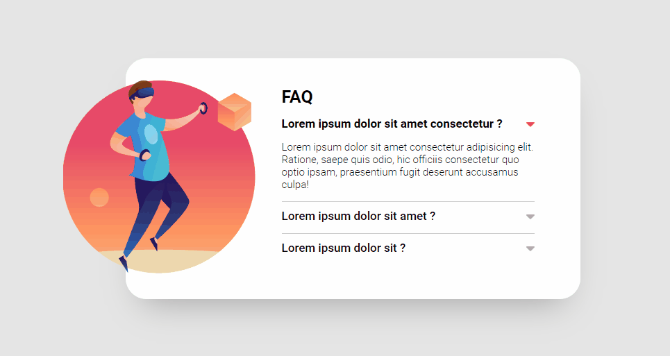

# Acordeon

Exercício desenvolvido no curso DevQuest. A proposta foi criar uma seção de perguntas frequentes com efeito acordeon. 

[] 

## Meu processo

### Tecnologias utilizadas

- HTML
- CSS
- JavaScript

### O que aprendi

A realização do exercício me ajudou muito na fixação e melhor entendimento sobre funções e uso do método forEach no JavaScript.  